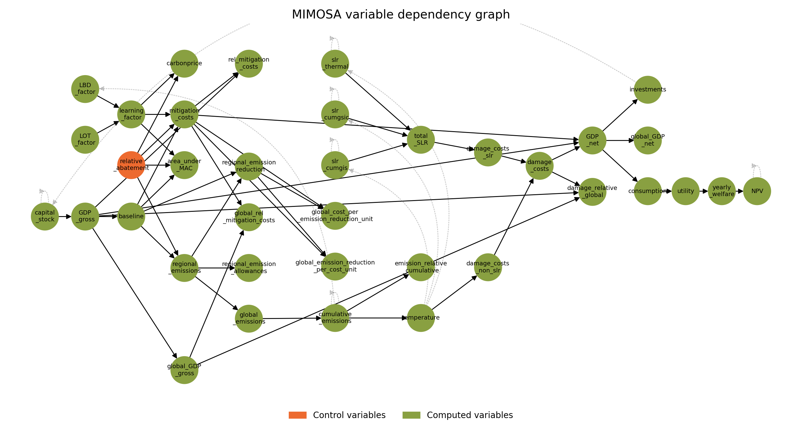
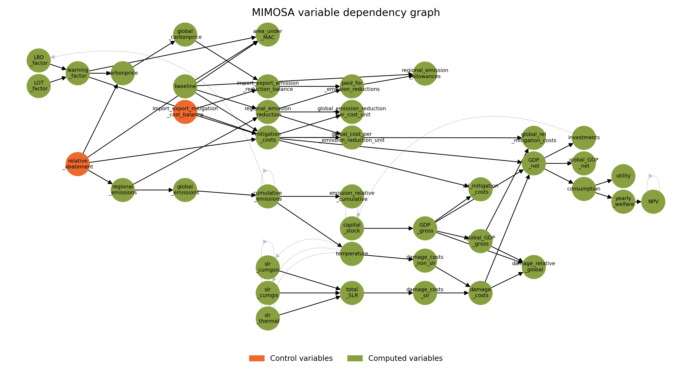

### Simulation: running MIMOSA without optimisation

MIMOSA can also be run in simulation mode, where the model is solved for a given set of parameters without optimisation. This is useful for scenarios where you beforehand choose the values of the control variables (the "input variables" of the model), such as a baseline scenario or sensitivity runs.

#### Control variables

Control variables are the variables that MIMOSA is optimising for in optimisation mode, or that you can set to specific values in simulation mode. All other variables are computed based on the control variables and the equations of the model. How they depend on each other is shown with the command, which plots the dependency graph of the MIMOSA variables:

```python
from mimosa import MIMOSA, load_params


params = load_params()
# Optionally, set your parameters here

model1 = MIMOSA(params)
model1.simulator.plot_dependency_graph()
```

??? info "Dependency graph of the MIMOSA variables"

    (Note that only equations are shown)

    === "With default parameters"

        

    === "With emission trading and cost-minimisation"

        

#### Default simulation: all control variables set to zero

When you run a simulation without specifying values for the control variables, MIMOSA will use the default values, which are all set to zero. This allows you to see the baseline behavior of the model before making any adjustments. By default, the only control variable is `relative_abatement`, which is set to zero in the default simulation:

``` python hl_lines="5 6"
--8<-- "tests/runs/run_sim_default.py"
```

1. This is equivalent to `model.run_simulation(relative_abatement=0)`.

#### Setting control variables to a value


#### Running a simulation using the values from an optimisation run

If you have previously run an optimisation and obtained values for the control variables, you can use these values as the starting point for your simulation. This allows you to see how the model behaves when the control variables are set to their optimal values, or to perform a sensitivity analysis by slightly changing one or more control variables.

See [Control variables](#control-variables) if you're unsure what the control variables are.

``` python hl_lines="16 21"
--8<-- "tests/runs/run_sim_from_opt.py"
```