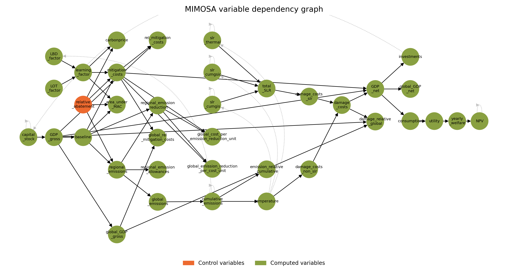
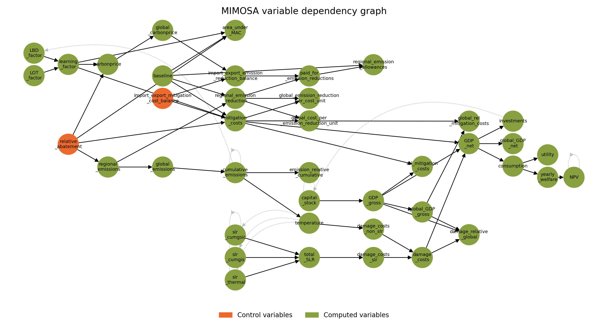

# Simulation and optimisation

MIMOSA can run in two different ways:

|                           | Optimisation           | Simulation                              |
| ------------------------- | ---------------------- | --------------------------------------- |
| Control variables         | Chosen by the solver   | Supplied by the user                    |
| Model equations           | Evaluated              | Evaluated                               |
| Constraints and objective | Used by the solver     | Not enforced                            |
| Typical purpose           | Find an optimal policy | Evaluate a specified policy or scenario |

In the default model, the main control variable is `relative_abatement`. Components can introduce additional control variables, such as adaptation choices. Once the controls are known, simulation mode evaluates the remaining equations in dependency order without calling an optimisation solver.

Simulation is especially useful for:

- creating a no-policy reference run;
- evaluating a prescribed mitigation or adaptation pathway;
- recalculating an optimisation result through the model equations;
- keeping the controls from one run fixed while changing assumptions in a new model.

Simulation does not determine whether a pathway is optimal. It also does not enforce ordinary Pyomo constraints (like a carbon budget), so supplied controls may produce a result that would be infeasible in an optimisation.

## Control variables

The available controls depend on the selected model components. You can inspect them after creating the model:

```python
from mimosa import MIMOSA, load_params

model = MIMOSA(load_params())

print(model.simulator.control_variables)
```

With the default components, this prints a list containing `relative_abatement`. When additional controls are present, they must be supplied in the same way.

!!! warning "Controls that are not supplied are set to zero"

    `run_simulation()` does not reuse values currently stored in the Pyomo model. Every control variable omitted from the call is set to zero. This is useful for a no-policy run, but it is important when replaying a model with more than one control variable.

## Use case 1: create a no-policy reference run

Use `run_nopolicy_baseline()` when all control variables should be zero and the result represents the no-policy reference:

```python
from mimosa import MIMOSA, load_params

params = load_params()
model = MIMOSA(params)

baseline = model.run_nopolicy_baseline()
model.save_simulation(baseline, "baseline_nopolicy")
```

Calling `run_simulation()` without arguments also evaluates the model with all controls set to zero. The difference is that `run_nopolicy_baseline()` additionally stores the resulting damage costs in `nopolicy_damage_costs`. MIMOSA uses this reference to calculate avoided damages in policy runs. Therefore, use `run_nopolicy_baseline()` when the result is intended to be the no-policy reference, and use `run_simulation()` for other prescribed scenarios.

When MIMOSA is created with the default `prerun=True`, it already calculates this reference internally to prepare the optimisation model. Calling `run_nopolicy_baseline()` explicitly gives you the simulation result so that you can inspect or save it.

The separate [baseline guide](baseline.md) shows both a no-policy scenario with damages and a baseline in which damages do not affect GDP.

## Use case 2: evaluate prescribed control values

A single number applies to every timestep and region:

```python
from mimosa import MIMOSA, load_params

model = MIMOSA(load_params())

simulation = model.run_simulation(relative_abatement=0.25)
model.save_simulation(simulation, "constant_25_percent_abatement")
```

For a pathway that varies over time or regions, a control can instead be supplied as:

- a NumPy array with the same shape as the control variable; or
- a dictionary keyed like the Pyomo variable, for example by `(timestep, region)`.

The model checks the shape and reports the available control names if an unknown variable is supplied.

## Use case 3: replay an optimisation result

Re-evaluating the controls from an optimisation is useful for checking the equation-based simulation against the optimised model or as the starting point for another scenario.

Copy all controls rather than assuming that `relative_abatement` is the only one:

```python
from mimosa import MIMOSA, load_params

params = load_params()
optimised_model = MIMOSA(params)
optimised_model.solve()

control_values = {
    name: getattr(optimised_model.concrete_model, name).extract_values()
    for name in optimised_model.simulator.control_variables
}

replay = optimised_model.run_simulation(**control_values)
optimised_model.save_simulation(replay, "optimisation_replayed")
```

The simulation recalculates variables from the copied controls; it does not continue or rerun the optimisation.

## Use case 4: keep a policy fixed while changing assumptions

To investigate how an already chosen policy performs under different assumptions, copy the controls from the original run into a newly configured model. For example, the following keeps the optimised controls fixed while changing the damage scale factor:

```python
from mimosa import MIMOSA, load_params

# Optimise under the original assumptions
original_params = load_params()
original_model = MIMOSA(original_params)
original_model.solve()

control_values = {
    name: getattr(original_model.concrete_model, name).extract_values()
    for name in original_model.simulator.control_variables
}

# Build a separate model with the alternative assumptions
sensitivity_params = load_params()
sensitivity_params["economics"]["damages"]["scale factor"] = 1.5
sensitivity_model = MIMOSA(sensitivity_params)

# Evaluate the original policy under the alternative assumptions
sensitivity = sensitivity_model.run_simulation(**control_values)
sensitivity_model.save_simulation(sensitivity, "fixed_policy_higher_damages")
```

This pattern can also be used to fix mitigation from one run while changing adaptation assumptions, or to represent an unplanned outcome in which the realised effectiveness differs from the assumptions used to choose the controls.

The original and new models must use compatible control variables, timesteps, and regions. If the new model introduces an additional control and it is not supplied, that control is set to zero.

## Saving simulation results

Simulation and optimisation results are saved with different methods:

```python
# After model.solve()
model.save("optimisation")

# After model.run_simulation() or model.run_nopolicy_baseline()
model.save_simulation(simulation, "simulation")
```

Both methods produce output that can be processed with the same plotting and analysis tools.

## When simulation is available

Simulation mode can be used when the selected model components define a sequence of equations without circular same-timestep dependencies. If the equations contain a circular dependency, MIMOSA cannot determine a sequential evaluation order. Optimisation may still be possible because a solver can handle equations simultaneously.

Ordinary constraints, such as bounds linking several decision variables or equity constraints, are not executed by the simulator. Use optimisation when those constraints need to determine the result, or check separately that prescribed controls satisfy them.

## Inspecting equation dependencies

The dependency graph shows how equation outputs depend on other model variables. It can help identify control variables and understand the simulation order:

```python
from mimosa import MIMOSA, load_params

model = MIMOSA(load_params())
model.simulator.plot_dependency_graph()
```

??? info "Dependency graph of the MIMOSA variables"

    Only relationships between equations are shown.

    === "With default parameters"

        

    === "With emission trading and cost minimisation"

        
